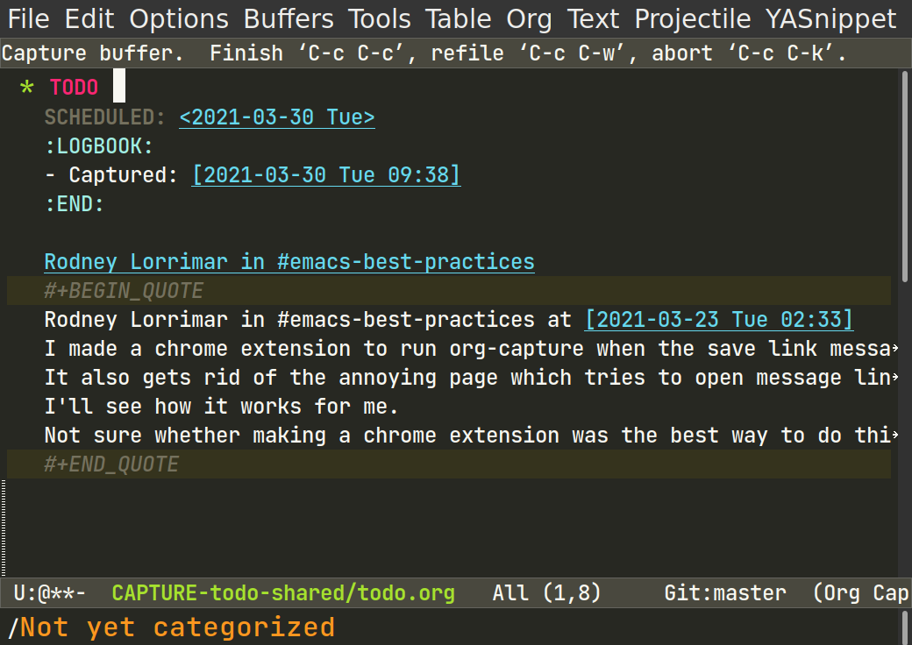

# Chrome extension to capture links to slack messages

This extension hijacks the "Add to saved items" button in Slack, and replaces it with an [org-protocol](https://orgmode.org/manual/The-capture-protocol.html#The-capture-protocol) call.

It also works around the super-annoying feature of Slack permalinks
where it tries to navigate to a `slack://` URI when you visit a
message link. It will now automagically follow the "Open in browser"
link.

## How to use

Find a message that you want to record. Click the unicorn button:


Emacs will then open a capture buffer containing a link to the
message, which you can edit then file away in your TODO list.



At a later time, you can revisit the Slack message by typing `C-c C-o`
on the link.

## Installing

Check out the source code, run:

```
npm install
npm run build
```

Then add the `dist` dir as an "Unpacked Extension" to your Chrome profile extensions.

## Configuration

You need to have org-protocl set up properly to begin with. So
`emacsclient` and a URL scheme handler for `org-protocol://` need to
be configured. Follow the instructions in the [org-mode
Manual](https://orgmode.org/manual/The-capture-protocol.html#The-capture-protocol)
then add the browser bookmarklet to check that it works.


The org-mode side is configured in a similar manner to [org-capture-extension](https://github.com/sprig/org-capture-extension).

Add something like the following to your `org-capture-templates`:

```lisp
(setq org-capture-templates
  '(("lm" "Slack message link" entry
      (file+headline org-default-notes-file "Slack inbox")
      "* TODO %?
  SCHEDULED: %t
  :LOGBOOK:
  - Captured: %U
  :END:

  [[%:link][%:description]]
  #+BEGIN_QUOTE
  %i
  #+END_QUOTE

")))
```

The capture key is hard-coded to `lm`.

## Extra configuration

Here are some extra things you can configure.

### Nix `home-manager`

Add the following module to your user's `home-manager` config to set
up URL scheme handlers:

```nix
{
  home-manager.users.MYUSERNAME = { pkgs, ... }: {
    # Enable emacs service and emacsclient
    programs.emacs.enable = true;
    services.emacs = {
      enable = true;
      client.enable = true;
      socketActivation.enable = true;
    };

    # Install desktop file for org-protocol://
    home.packages = [ (pkgs.makeDesktopItem {
      name = "org-protocol";
      desktopName = "org-protocol";
      icon = "emacs";
      exec = "emacsclient %u";
      categories = "System";
      mimeType = "x-scheme-handler/org-protocol";
    }) ];

    xdg.mimeApps = {
      enable = true;
      # Associate org-protocol:// with emacsclient
      defaultApplications."x-scheme-handler/org-protocol" = "org-protocol.desktop";
      # Disable slack:// URL handler
      associations.removed."x-scheme-handler/slack" = "slack.desktop";
    };
  };
}
```

### Emacs link opening

If you want Emacs to open links in eww or Emacs W3 by default, but
still open Slack message links in Chrome, then add something like this
to `.emacs`:

```lisp
(setq browse-url-browser-function
      '(("^/" . browse-url-emacs)
        ("\\`[^:]+\\'" . browse-url-emacs)
        ("\\`file://" . browse-url-emacs)
        ("https://.*\\.slack.com.*" . browse-url-xdg-open)
        ("." . eww-browse-url)))
```

It assumes that your `browse-url-xdg-open` function will run Chrome.

## Work in progress

This is very rough code, under development. There is still some leftover example code from the Chrome Extensions tutorial.

### TODO

- [ ] Remove example code from tutorial.
- [ ] Convert UTC timestamps to local timezone.
- [ ] Allow configuration of the org-capture key (currently hardcoded to "lm").
- [ ] Find a way to block the permalink page from opening the
      `slack://` URI.
- [ ] Also capture the thread topic message, if the message was in a
      thread.
- [ ] Add a button to show the Slack auth token that was found by this
      extension.
- [ ] Add "quickview" of links to GitHub/Jira issues. So user can just
      hover over the link to see a preview of its content.
